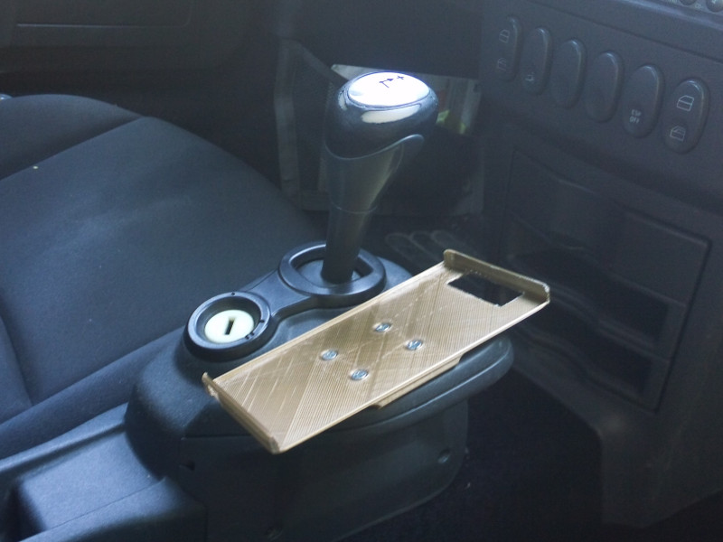
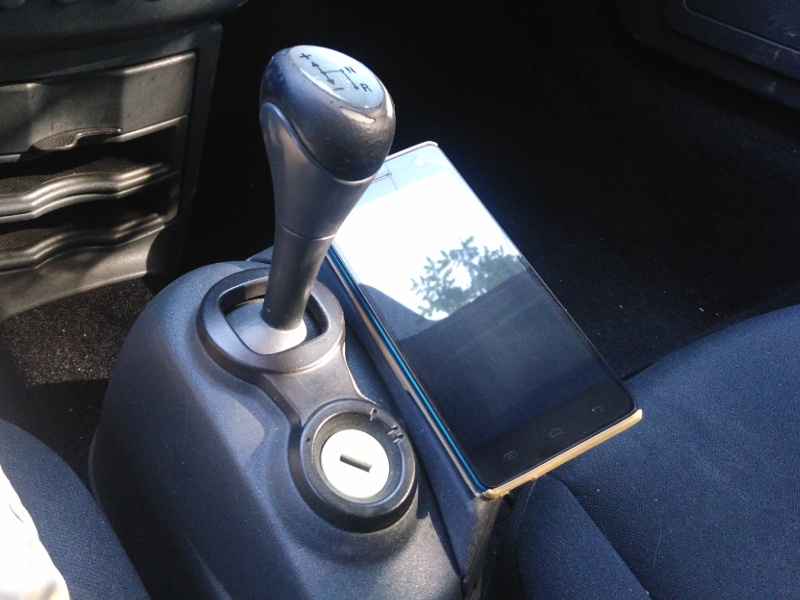
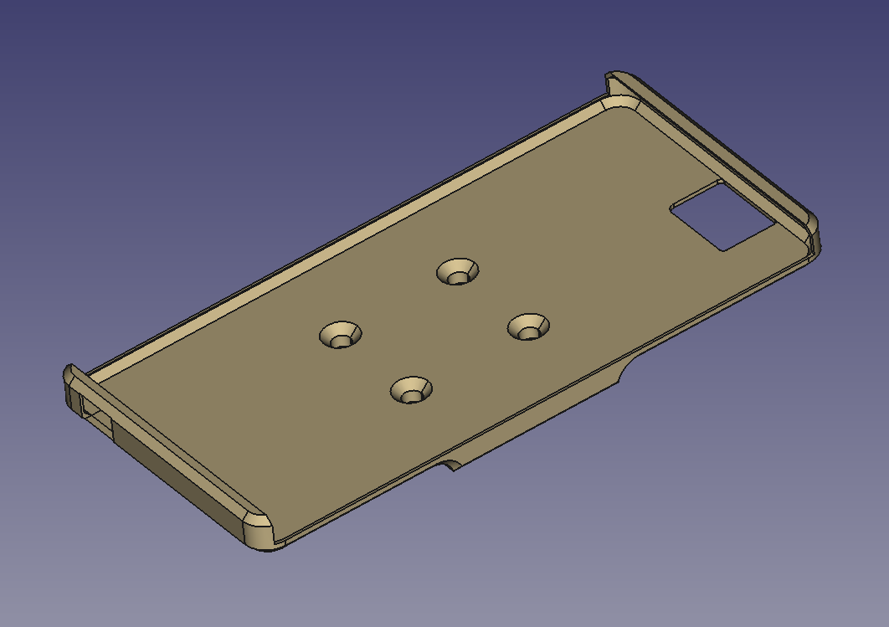
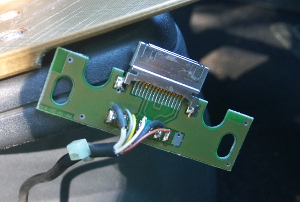

# Support Wiko Highway 4G pour Smart Roadster

Support Smart Roadster pour smartphone Wiko Highway 4G.
Pour montage en lieu et place du support pour iPod. 

## Prototype V0 - 13/07/2015
### Paramètres du slice
J'ai appliqué un scale de 1.003 pour un jeu de 0.4 mm sur la longeur et 0.2 mm en largeur.

### Retours sur le proto V0
- Le scale appliqué n'est pas suffisant je pense. On sent le Highway bien à l'étroit. Cela étant cela passe tout juste et le smartphone est maintenu comme dans une coque ultra ajustée.
- Pour pouvoir l'enficher j'ai néanmoins du faire sauter les couches supérieures sur la partie avant. Je pense que pour la prochain itération le modèle doit prévoir cette ouverture dès le départ et chercher à maintenir simplement la pression sur l'axe longitudinal.
- L'ouverture pour la caméra avant n'était pas du bon côté. Angy a élargi cette ouverture sur la largeur pour que ca passe. J'ai corrigé le modèle mais le positionnement n'est donc pas "vérifié".
- Il faudrait élargir un peu l'ouverture pour la prise USB vers la droite.

## Idées d'améliorations
- cf retours du v0
- des petits trous pour le haut-parleur inférieur
- une inclinaison plus prononcée pour affichage en paysage sur le smartphone, avec un peu d'angle vers l'avant
- ajout d'un bloc inférieur pour intégrer une prise mini USB alimentée par une adaptation du câble restant du montage iPod

## License
Modèle et photos par Frédéric "Couby" Coubard.

